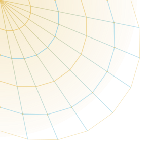
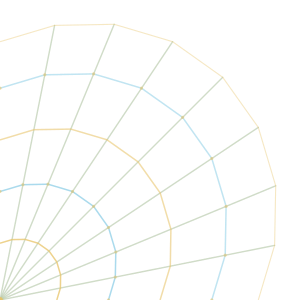
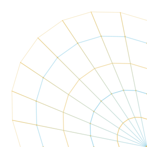

&nbsp;

 

<table width="100%">
<tr>
<td width="38%" align="center">

</td>
<td width="62%" valign="middle">

# Nuñez
### Desarrollador · Automatización · IA

 Estudiante de Programación y Diseño de Bases de Datos en el **SENA**, construyendo con disciplina, precisión y estilo. Enfocado en automatización inteligente, desarrollo web moderno y experimentación con inteligencia artificial.

`Never stop building.` · Abierto a **open source** y colaboraciones.

📩 addununeznunezavila@gmail.com

</td>
</tr>
</table>

💛 *dedicado a mi persona favorita* 💛

---

<table width="100%">
<tr>
<td width="90"></td>
<td></td>
<td align="right" width="90"></td>
</tr>
<tr>
<td colspan="3">

##  Stack Tecnológico

 

<b>🟡 Nivel Avanzado</b> 

  

<b>🔵 Nivel Intermedio</b> 

  

<b>⚪ Iniciando / Aprendiendo</b> 

</td>
</tr>
<tr>
<td></td>
<td></td>
<td align="right"></td>
</tr>
</table>

---

###  Datos & Herramientas

<table width="100%">
<tr>
<td width="90"></td>
<td></td>
<td align="right" width="90"></td>
</tr>
<tr>
<td colspan="3">

  

</td>
</tr>
<tr>
<td></td>
<td></td>
<td align="right"></td>
</tr>
</table>

---

##  GitHub

  

---

##  Hobbies & Intereses

 

---

##  Redes & Contacto

&nbsp;

&nbsp;

---

