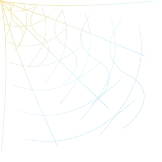
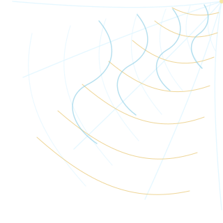
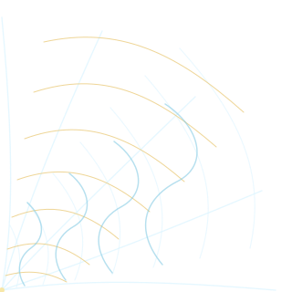
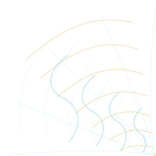

  

  
  

<h3 align="center">Construyo soluciones claras, útiles y escalables.</h3>

  Estudiante de Programación y Diseño de Bases de Datos en el <b>SENA</b>. 
  Me enfoco en automatización, desarrollo web e inteligencia artificial.

  
  

---

  
  &emsp;&emsp;&emsp;&emsp;&emsp;&emsp;
  

<h2 align="center">Stack tecnológico</h2>

  
  
  
  
  
  
   
  
  
  
  
  

  
  &emsp;&emsp;&emsp;&emsp;&emsp;&emsp;
  

---

<h2 align="center">Un poco más sobre mí</h2>

  

---

  

  

